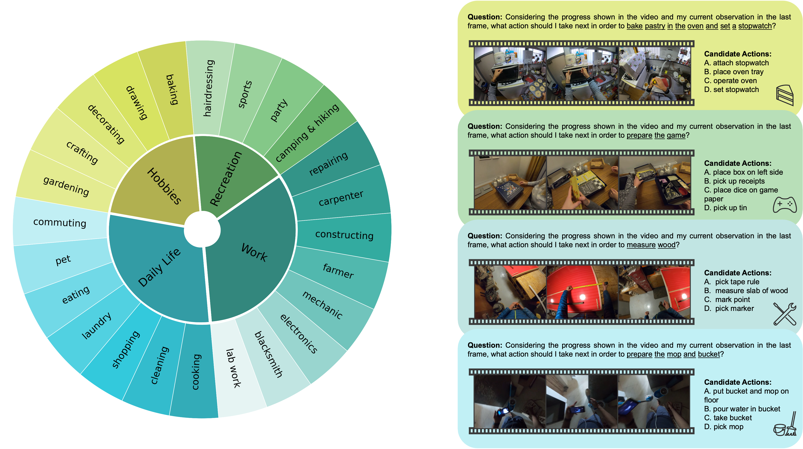

<div align="center">
<h1>
EgoPlan-Bench2: A Benchmark for Multimodal Large Language Model Planning in Real-World Scenarios

<a href='https://qiulu66.github.io/egoplanbench2/'></a>
<a href=''></a> 
<a href='https://huggingface.co/datasets/qiulu66/EgoPlan-Bench2/tree/main'></a>
</h1>

<p align="center">
  
</p>

</div>

---

## 📌 Table of Contents
- [EgoPlan-Bench2 Overview](#-egoplan-bench2-overview)
- [Dataset Examples](#-dataset-examples)
- [Evaluation Pipeline](#-evaluation-pipeline)
- [Run Prompting and CoT](#-run-prompting-and-cot)
- [Citation](#black_nib-citation)
- [Related Works](#-related-works)


## 👀 EgoPlan-Bench2 Overview

The advent of Multimodal Large Language Models (MLLMs), leveraging the power of Large Language Models, has recently demonstrated superior multimodal understanding and reasoning abilities, heralding a new era for artificial general intelligence (AGI). However, achieving AGI necessitates more than just comprehension and reasoning. A crucial capability required is effective planning in diverse scenarios, which involves making reasonable decisions based on complex environments to solve real-world problems. Despite its importance, the planning abilities of current MLLMs in varied scenarios remain underexplored, leaving a significant gap in our understanding of their full potential.

In this paper, we introduce **EgoPlan-Bench2**, a rigorous and comprehensive benchmark designed to assess the planning capabilities of MLLMs across a wide range of real-world scenarios. EgoPlan-Bench2 encompasses everyday tasks spanning 4 major domains and 24 detailed scenarios, closely aligned with human daily life. EgoPlan-Bench2 is constructed through a semi-automatic process utilizing egocentric videos, complemented by manual verification. Grounded in a first-person perspective, it mirrors the way humans approach problem-solving in everyday life. We evaluate 21 competitive MLLMs and provide an in-depth analysis of their limitations, revealing that they face significant challenges in real-world planning. To further improve the planning proficiency of current MLLMs, we propose a training-free approach using multimodal Chain-of-Thought (CoT) prompting through investigating the effectiveness of various multimodal prompts in complex planning. Our approach enhances the performance of GPT-4V by 10.24% on EgoPlan-Bench2 without additional training. Our work not only sheds light on the current limitations of MLLMs in planning, but also provides insights for future enhancements in this critical area.

This repository describes the usage of our proposed EgoPlan-Bench2, and provides the corresponding codes for benchmarking MLLMs and enhancing GPT-4V's performance by multimodal CoT prompting. Welcome to evaluate your models and explore methods to enhance the models' EgoPlan capabilities on our benchmark!

<div>
<p align="center">
  
</p>
</div>

## 📐 Dataset Examples
<div>
<p align="center">
  
</p>
</div>

## 🔮 Evaluation Pipeline

📍 **Download Egocentric Videos**:

EgoPlan-Bench2 is constructed based on the Ego4D dataset. Download the videos of [Ego4D](https://ego4d-data.org/#download). The folder structure of the dataset is shown below:
```
Ego4D
└──v1_288p
    ├── 0d270946-95c5-4e71-ae49-b9e802548147.mp4
    ├── 2a2ff7db-5460-4296-a8a7-946ba628226d.mp4
    └── ...
```

📍 **Benchmark**:

Please click [this link](https://huggingface.co/datasets/qiulu66/EgoPlan-Bench2/tree/main) to download EgoPlan-Bench2.

Questions from the human-verified evaluation data are formatted as multiple-choice problems. MLLMs need to select the most reasonable answer from four candidate choices. The primary metric is Accuracy.

Below shows an example from EgoPlan-Bench2:
```
{
    "sample_id": "ca6e9ec9-46ac-4a02-8034-7c31157dc52c_2",
    "domain": "Hobbies",
    "scenario": "baking",
    "task_goal": "bake pastry in the oven and set a stopwatch",
    "choice_a": "attach stopwatch",
    "choice_b": "place oven tray",
    "choice_c": "operate oven",
    "choice_d": "set stopwatch",
    "golden_choice_idx": "A",
    "answer": "attach stopwatch",
    "task_start_frame": 0,
    "current_observation_frame": 656,
    "task_progress_metadata": [
        {
            "narration_text": "open oven",
            "start_frame": 0,
            "stop_frame": 28
        },
        {
            "narration_text": "place oven tray",
            "start_frame": 87,
            "stop_frame": 105
        },
        {
            "narration_text": "close oven",
            "start_frame": 301,
            "stop_frame": 316
        },
        {
            "narration_text": "operate oven",
            "start_frame": 353,
            "stop_frame": 371
        },
        {
            "narration_text": "detach stopwatch",
            "start_frame": 503,
            "stop_frame": 521
        },
        {
            "narration_text": "set stopwatch",
            "start_frame": 537,
            "stop_frame": 555
        }
    ]
}
```

📍 **Prompt**:

The common prompt used in our evaluation follows this format:
```
Select the best answer to the following multiple-choice question based on the video. Respond with only the letter (A, B, C, or D) of the correct option. 
Considering the progress shown in the video and my current observation in the last frame, what action should I take next in order to [task goal]? 
[candidate choices]
```

📍 **Evaluation**: 

Two examples for image MLLM [(InternVL-2)](https://github.com/OpenGVLab/InternVL) and video MLLM [(LongVA)](https://github.com/EvolvingLMMs-Lab/LongVA) are provided. 

Set the paths for the `project root`, `model weights`, `annotation` and `Ego4D videos` in [eval_EgoPlan2_internvl2.sh](scripts/eval_EgoPlan2_internvl2.sh) and [eval_EgoPlan2_longva.sh](scripts/eval_EgoPlan2_longva.sh).<br>

Then, run the script on 1xA100 (40G) GPU:
```bash
bash scripts/eval_EgoPlan2_internvl2.sh
```
```bash
bash scripts/eval_EgoPlan2_longva.sh
```

## 🔍 Run Multimodal CoT Prompting

📍 **Method Overview**:

<div>
<p align="center">
  
</p>
</div>

📍 **Task Progress Prompting**:

To exreact action sequences from the historical task progress, please first change the api key of GPT in [call_gpt.py](CoT/call_gpt.py), and then run the following code:
```bash
python CoT/create_action_seq.py \
    --video_dir $YOUR_VIDEO_FOLD \
    --anno_path $YOUR_ANNOTATION_PATH
```

📍 **Current Observation State Prompting**:

GroundingDINO is employed to create visual prompts for the current observation state. You should refer to [GroundingDINO](https://github.com/IDEA-Research/GroundingDINO) to install dependent packages and download the model weight.
```bash
git clone https://github.com/IDEA-Research/GroundingDINO.git
cd GroundingDINO/
pip install -e .
```
```bash
mkdir weights
cd weights
wget -q https://github.com/IDEA-Research/GroundingDINO/releases/download/v0.1.0-alpha/groundingdino_swint_ogc.pth
cd ..
```
Then, run the following code:
```bash
python CoT/create_bounding_box.py \
    --dino_dir $YOUR_DINO_FOLD \
    --anno_path $YOUR_ANNOTATION_PATH
```

📍 **Prompt-Based Reasoning**:

Run the script to get the final results:
```bash
bash scripts/cot.sh
```

## :black_nib: Citation

If you find our work helpful for your research, please consider citing our work.   

## 📜 Related Works

Explore our related researches:
-  **[EgoPlan-Bench]** [EgoPlan-Bench: Benchmarking Multimodal Large Language Models for Human-Level Planning](https://github.com/ChenYi99/EgoPlan)
