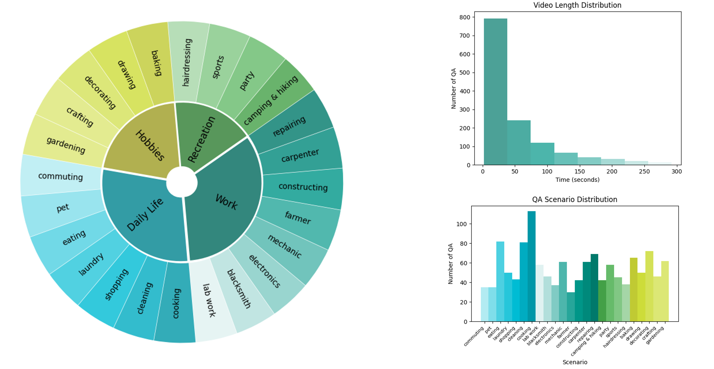
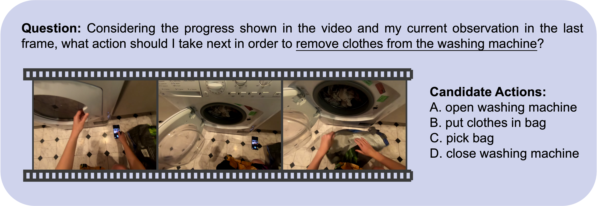

<div align="center">
<h1>
EgoPlan-Bench2: A Planning Benchmark for Multi-modal Large Language Models in Diverse Real-World Scenarios
</h1>

<p align="center">
  
</p>

</div>

---

## 📌 Table of Contents
- EgoPlan-Bench2 Overview
- Dataset Examples
- Evaluation Pipeline
- Run Prompting and CoT
- Citation
- Related Works


## 👀 EgoPlan-Bench2 Overview

The rapid development of Multi-modal Large Language Models (MLLMs) which combine remarkable comprehension and generalization capacities has highlighted their potential ways to Artificial General Intelligence (AGI). A key milestone in AGI is achieving human-level task planning capabilities, which is essential for managing everyday human activities. This capability empowers models to make informed decisions in intricate environments, assisting humans in addressing a broad range of real-world challenges. Despite the notable progress within the realm of MLLMs, questions still remains: how effectively do MLLMs perform in real-world planning tasks, and how far are MLLMs from human-level task planners?

In the quest for answering these questions, we introduce **EgoPlan-Bench2**, a comprehensive benchmark designed to evaluate MLLMs across diverse real-world planning tasks. EgoPlan-Bench2 is built upon the principles of first-person perspective and an extremely rich set of real-world tasks spanning 4 key domains and 24 fine-grained scenarios in human life, with a focus on evaluating models' planning abilities. We evaluate a wide range of MLLMs and observe that they still face substantial challenges, underscoring the need for considerable enhancements to attain human-level planning proficiency. To compensate the deficiency of the model and foster further improvements, we develop diverse prompts tailored to the characteristics of planning tasks, thereby augmenting the performance of GPT-4V on EgoPlan-Bench2 in a train-free manner.

This repository describes the usage of our proposed EgoPlan-Bench2, and provides the corresponding codes for benchmarking MLLMs and enhancing GPT-4V's performance by prompting and CoT. Welcome to evaluate your models and explore methods to enhance the models' EgoPlan capabilities on our benchmark!

<div>
<p align="center">
  
</p>
</div>

## 📐 Dataset Examples
<div>
<p align="center">
  
</p>
</div>

## 🔮 Evaluation Pipeline

📍 **Download Egocentric Videos**:

EgoPlan-Bench2 is constructed based on the Ego4D dataset. Download the videos of [Ego4D](https://ego4d-data.org/#download). The folder structure of the dataset is shown below:
```
Ego4D
└──v1_288p
    ├── 0d270946-95c5-4e71-ae49-b9e802548147.mp4
    ├── 2a2ff7db-5460-4296-a8a7-946ba628226d.mp4
    └── ...
```

📍 **Benchmark**:

Questions from the human-verified evaluation data are formatted as multiple-choice problems. MLLMs need to select the most reasonable answer from four candidate choices. The primary metric is Accuracy.

Below shows an example from EgoPlan-Bench2:
```
{
    "sample_id": "ca6e9ec9-46ac-4a02-8034-7c31157dc52c_2",
    "domain": "Hobbies",
    "scenario": "baking",
    "task_goal": "bake pastry in the oven and set a stopwatch",
    "choice_a": "attach stopwatch",
    "choice_b": "place oven tray",
    "choice_c": "operate oven",
    "choice_d": "set stopwatch",
    "golden_choice_idx": "A",
    "answer": "attach stopwatch",
    "task_start_frame": 0,
    "current_observation_frame": 656,
    "task_progress_metadata": [
        {
            "narration_text": "open oven",
            "start_frame": 0,
            "stop_frame": 28
        },
        {
            "narration_text": "place oven tray",
            "start_frame": 87,
            "stop_frame": 105
        },
        {
            "narration_text": "close oven",
            "start_frame": 301,
            "stop_frame": 316
        },
        {
            "narration_text": "operate oven",
            "start_frame": 353,
            "stop_frame": 371
        },
        {
            "narration_text": "detach stopwatch",
            "start_frame": 503,
            "stop_frame": 521
        },
        {
            "narration_text": "set stopwatch",
            "start_frame": 537,
            "stop_frame": 555
        }
    ]
}
```

📍 **Prompt**:

The common prompt used in our evaluation follows this format:
```
Select the best answer to the following multiple-choice question based on the video. Respond with only the letter (A, B, C, or D) of the correct option. 
Considering the progress shown in the video and my current observation in the last frame, what action should I take next in order to [task goal]? 
[candidate choices]
```

📍 **Evaluation**: 

Two examples for image MLLM [(InternVL-2)](https://github.com/OpenGVLab/InternVL) and video MLLM [(LongVA)](https://github.com/EvolvingLMMs-Lab/LongVA) are provided. 

Set the paths for the `project root`, `model weights`, `annotation` and `Ego4D videos` in [eval_EgoPlan2_internvl2.sh](scripts/eval_EgoPlan2_internvl2.sh) and [eval_EgoPlan2_longva.sh](scripts/eval_EgoPlan2_longva.sh).<br>

Then, run the script on 1xA100 (40G) GPU:
```bash
bash scripts/eval_EgoPlan2_internvl2.sh
```
```bash
bash scripts/eval_EgoPlan2_longva.sh
```

## 🔍 Run Prompting and CoT

📍 **Task progress Prompting**:

To exreact action sequences from the historical task progress, please first change the api key of GPT in [call_gpt.py](CoT/call_gpt.py), and then run the following code:
```bash
cd CoT
python create_action_seq.py \
    --video_dir $YOUR_VIDEO_FOLD \
    --anno_path $YOUR_ANNOTATION_PATH
```

📍 **Current Observation State Prompting**:

GroundingDINO is employed to create visual prompts for the current observation state. You should refer to [GroundingDINO](https://github.com/IDEA-Research/GroundingDINO) to install dependent packages and download the model weight.
```bash
git clone https://github.com/IDEA-Research/GroundingDINO.git
cd GroundingDINO/
pip install -e .
```
```bash
mkdir weights
cd weights
wget -q https://github.com/IDEA-Research/GroundingDINO/releases/download/v0.1.0-alpha/groundingdino_swint_ogc.pth
cd ..
```
Then, run the following code:
```bash
cd CoT
python create_bounding_box.py \
    --dino_dir $YOUR_DINO_FOLD \
    --anno_path $YOUR_ANNOTATION_PATH
```

📍 **CoT Reasoning**:

Run the script to get the final results:
```bash
bash scripts/cot.sh
```

## :black_nib: Citation

If you find our work helpful for your research, please consider citing our work.   

## 📜 Related Works

Explore our related researches:
-  **[EgoPlan-Bench]** [EgoPlan-Bench: Benchmarking Multimodal Large Language Models for Human-Level Planning](https://github.com/ChenYi99/EgoPlan)
